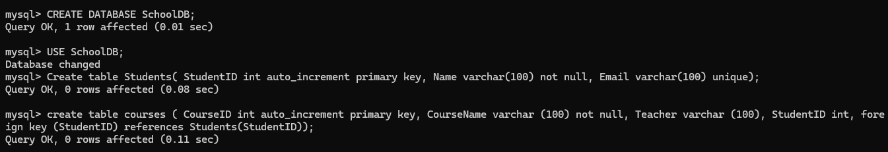
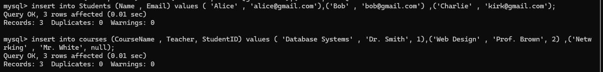
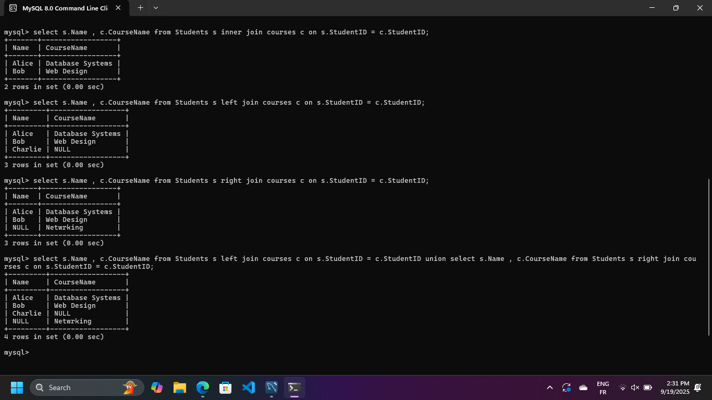
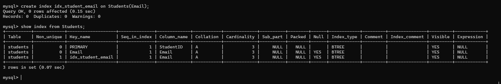

# SQL Assignment Report  

## Group Members  
1. **AKARIZA GASANA Leslie** – 27413  
2.  
3.  

---

##  Introduction  
This project demonstrates the use of SQL to **create and manipulate a relational database**.  

### Key tasks included:  
- Creating tables with constraints.  
- Performing different types of joins.  
- Creating an index to improve performance.  
- Creating a view to simplify queries.  

---

##  Database Design and Table Creation  
We created a new database named **`SchoolDB`** with two tables: **`Students`** and **`Courses`**.  

### Constraints Applied:  
- **Primary Key**: Both tables have primary keys.  
- **Not Null**: Ensures important fields (e.g., `Name`, `CourseName`) are not empty.  
- **Unique**: The `Email` field in `Students` must be unique.  
- **Foreign Key**: `StudentID` in `Courses` references `StudentID` in `Students`.  

---

##  Data Insertion  
Sample data was inserted into the `Students` and `Courses` tables for testing.  

---

##  Join Operations  
We tested different join types to explore table relationships:  

- **Inner Join** → Returns only students enrolled in a course.  
- **Left Join** → Shows all students, even those not enrolled.  
- **Right Join** → Shows all courses, even if no students are enrolled.  
- **Full Outer Join** → Simulated using `UNION` (combines left + right).  

---

##  Index Creation  
An **index** was created on the `Email` field to optimize searches.  
- This improved query speed when searching by email.  

---

##  View Creation  
A **view** was created to simplify queries and reporting, providing quick access to useful data without rewriting complex SQL queries.  

---

##  Conclusion  
Through this assignment, we demonstrated key SQL concepts:  

- **Database design with constraints** → Ensures data accuracy and relationships.  
- **Join operations** → Provide flexible ways to retrieve related data.  
- **Indexes** → Improve performance for frequently queried fields.  
- **Views** → Simplify reporting and abstract complex queries.  

This project highlights the **practical importance of SQL** in real-world database management and reporting.  

---
